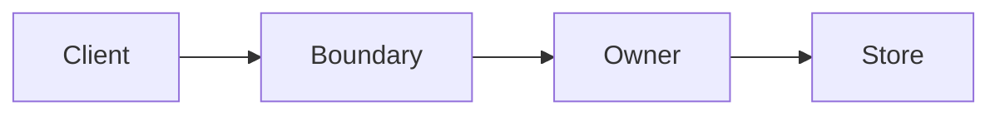

# Architecture Documentation and System-Design Responses

This document defines how jcode records system design so that agents can navigate
the codebase and humans can understand important changes without reading every
implementation file.

## Source of truth

Architecture documentation has two layers:

1. **Authoritative explanation** - Markdown, code, tests, and configuration. These
   describe behavior, ownership, invariants, failure modes, and rollback paths.
2. **Navigational views** - Mermaid, D2, or another diagram source plus an optional
   rendered artifact. These show relationships and boundaries but do not replace the
   explanation or implementation.

The rendered image is for human orientation. Agents should normally consume the
Markdown and diagram source, then inspect the linked code and tests when a change
requires more detail.

## When to add or update an architecture document

Update an existing document, or add a focused document, when a change:

- crosses crate or subsystem boundaries;
- changes ownership of state, data, or side effects;
- changes a public runtime or integration boundary;
- changes an asynchronous pipeline, cache, or lifecycle;
- changes a trust, security, payment, deployment, or rollback boundary; or
- would be difficult to explain with only a file list.

Do not create a diagram for a local implementation change that does not alter the
system shape. Prefer several small diagrams over one map of the entire repository.

## Required document shape

An architecture document should answer these questions in this order:

1. **Purpose and scope** - what system or boundary is covered;
2. **Current behavior** - what happens today, not only the desired design;
3. **Components and ownership** - who owns state, decisions, and side effects;
4. **Main flow** - request, data, event, or control flow;
5. **Invariants and failure behavior** - what must remain true and how failures recover;
6. **Code map** - the files or crates that implement each responsibility;
7. **Diagram source** - an inline Mermaid/D2 block or a linked source file when a
   visual view makes the structure easier to scan.

If the document describes a proposal rather than current behavior, place it under
`docs/plans/` or `docs/proposals/` according to the documentation index.

## jcode response convention

For a substantive cross-module or architecture change, the final response should
include these sections:

````markdown
## System design

One short paragraph explaining what changed and how the main flow now works.



## Boundaries and invariants

- Which component owns each important decision or side effect.
- Which trust, failure, or rollback rules must remain true.

## Changed files

- `path/to/file`: responsibility changed by this work.

## Validation

- Tests, runtime smoke checks, or other acceptance evidence.
````

Use the sections only when they add information. Small local changes should retain
the normal concise response format.

Jcode currently renders Mermaid diagrams in chat and side panels. D2/TALA diagrams
may be kept as repository artifacts when their layout is more useful, but native D2
rendering in jcode is intentionally not part of this convention. That decision can
be revisited after a real documentation pilot demonstrates a benefit that Mermaid
does not provide.

## Pilot

`docs/MERMAID_RENDERING_REDESIGN.md` is the first pilot for this convention. It
documents a cross-module rendering pipeline, names ownership boundaries, shows the
flow inline, and lists concrete validation criteria. Future architecture changes
should follow the same pattern without copying its implementation-specific details.
